# How to use Ballerina Integrator Copilot effetcively.

## Prerequisties:


## Example 1: Generate OpenAPI Specs and service code

1. Let's start by creating a new integration in Ballerina Integrator. 
    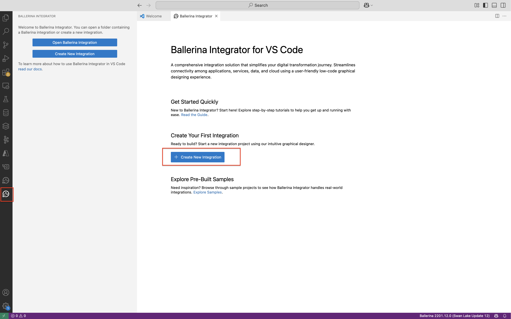

    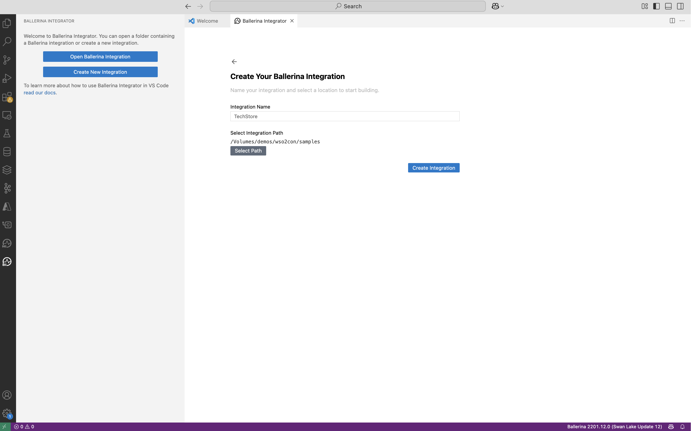

- Integration name : `TechStore`
- Integration Path : Select a local path

2. Click on `Generate with AI` button and it will open the WSO2 Copilot window. 

    


3. This will open up WSO2 Copilot manage account view. Login to WSO2 Copilot to start using it. You will be redirected to WSO2 Asgardeo Sign In page during this.Also you can enable GitHub Copilot if you have a subsciption already. 

    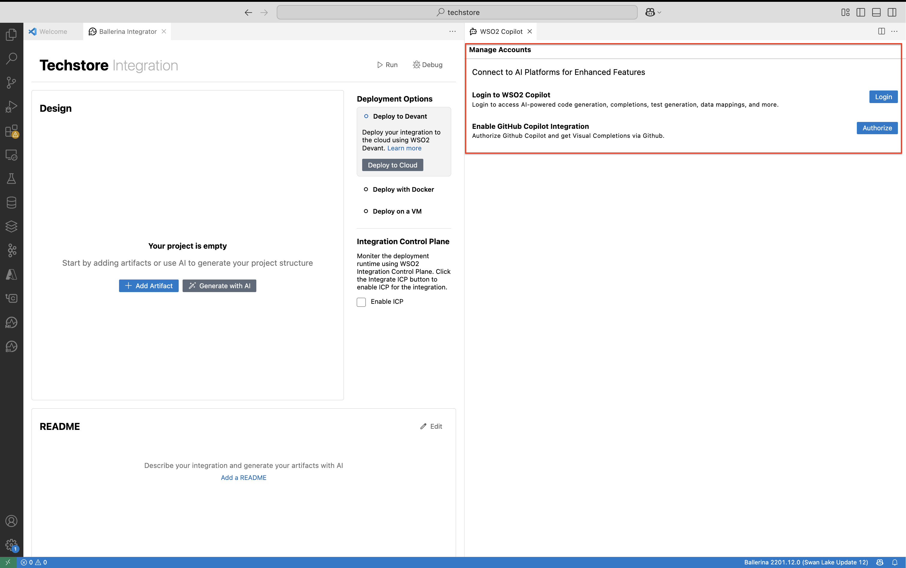


    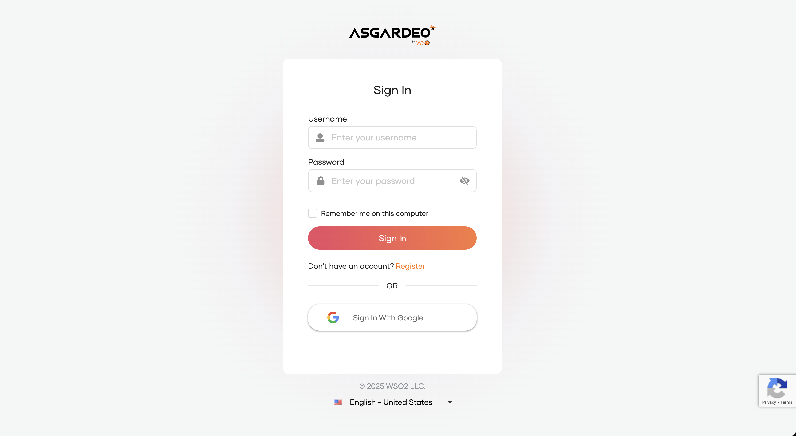

4. It will open up the WSO2 Copilot window with various options as follows. 

    

5. Let's use `/openapi` with follwoing prompt to generate OpenAPI spec for order service.

    ```
    Generate OpenAPI spec for computer hardware store to manage order
    ```

    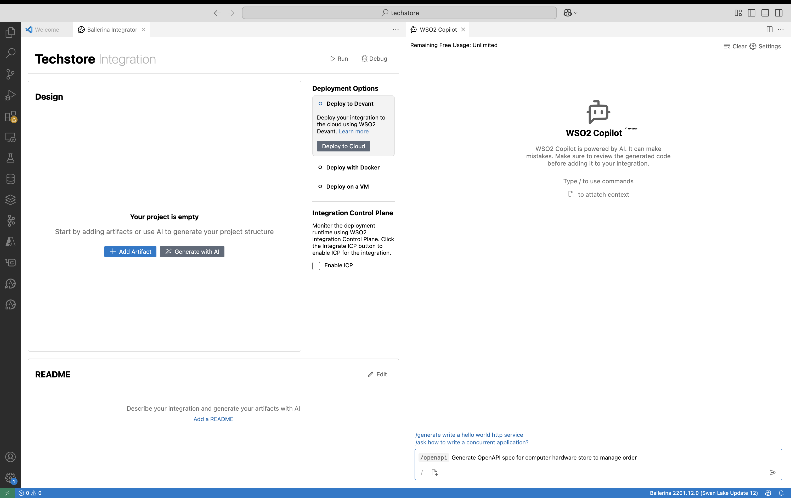

6. It generated the spec and you can add it to the integration project after reviewing.

    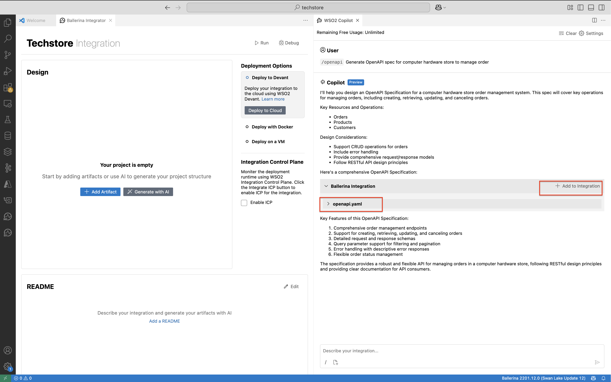

7. Now let's generate the source code for this service using the generated spec. You can use `/generate` with a prompt like below. Then you can add the generated code to the integration project. 

    ```
    Generate code for the above spec.
    ```

8. Add the generated code to the integration project. 

    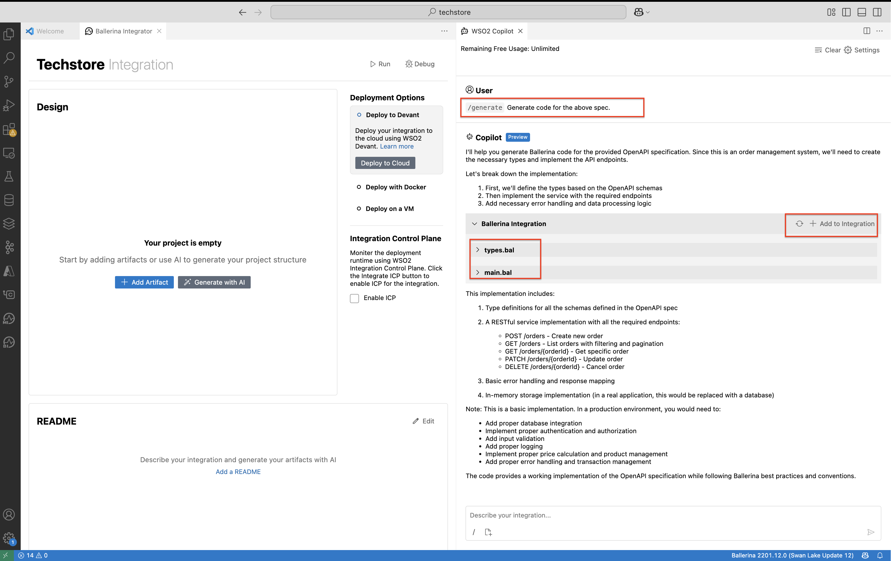

9. Now, you can explore and edit the generated service if needed. 

    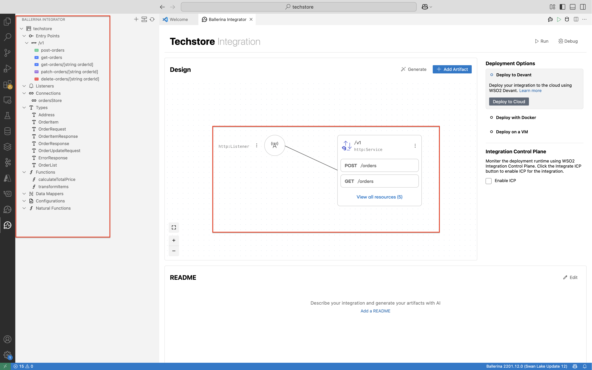

    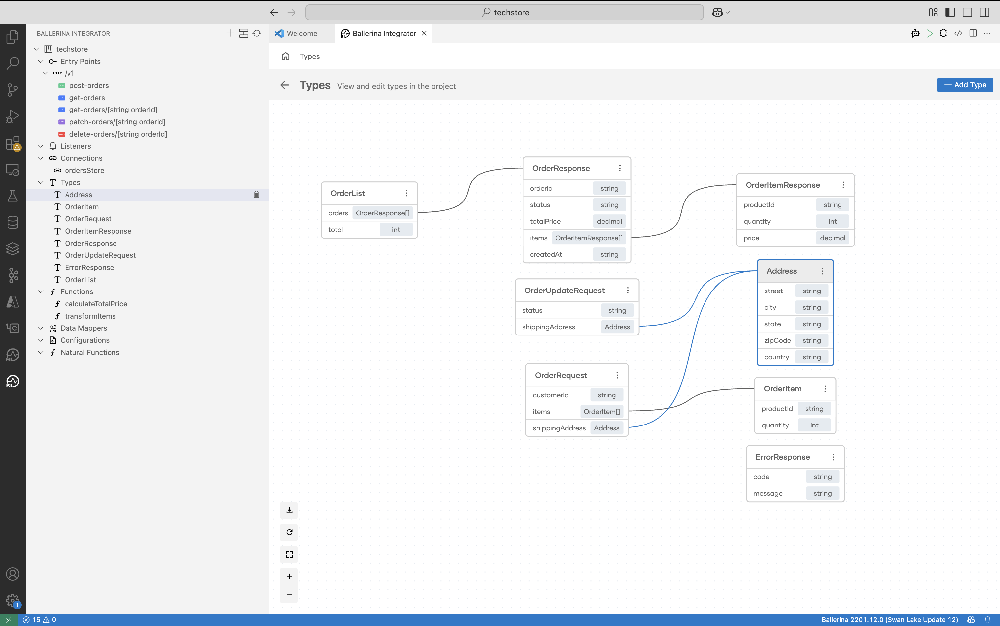

    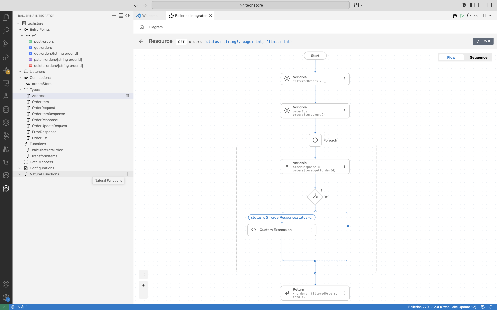

10. Finally, let's generate tests for the service using `/tests` with the following prompt.You can use `@` within the prompt to list down available service names within your project. 

    ```
    /tests generate test using /v1 service 
    ```
    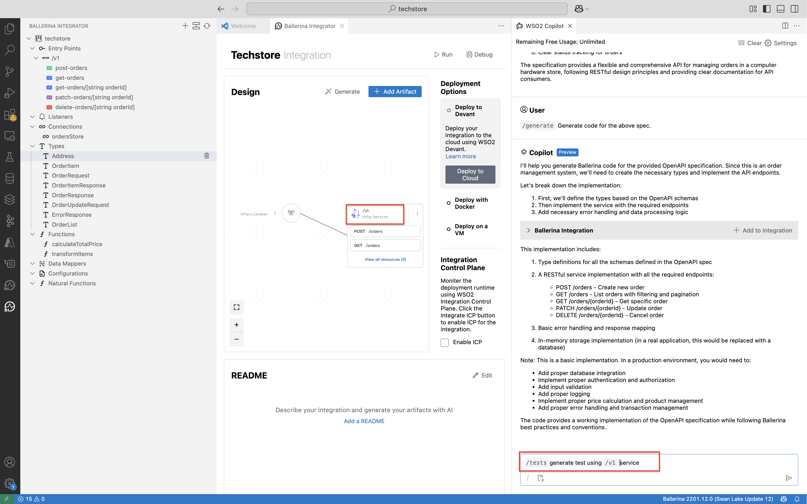

11. First it will create the test plan and then the tests which we can add to the project. 


    

## Example 2 : Ask Ballerina questions 

You can  get more accurate answers to your Ballerina questions by using `/ask`. 

```
/ask What is isolated in Ballerina?
```

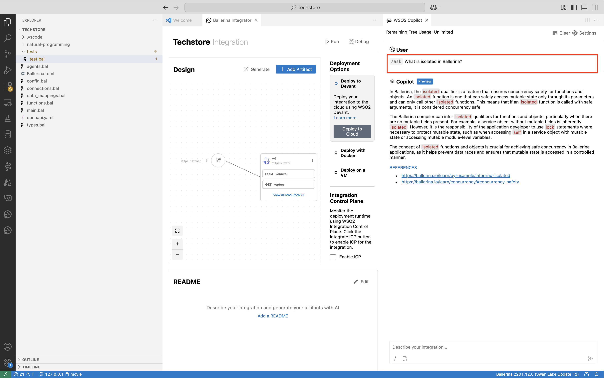