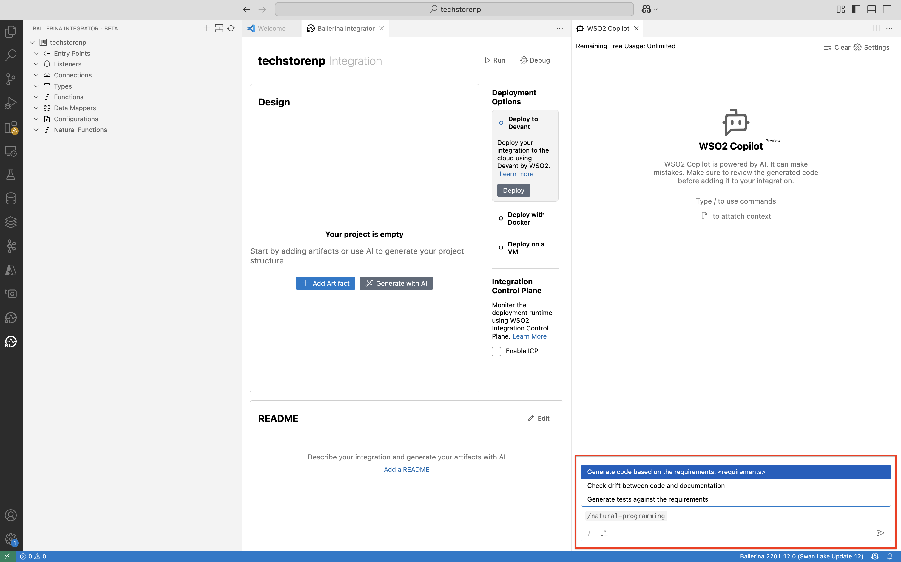
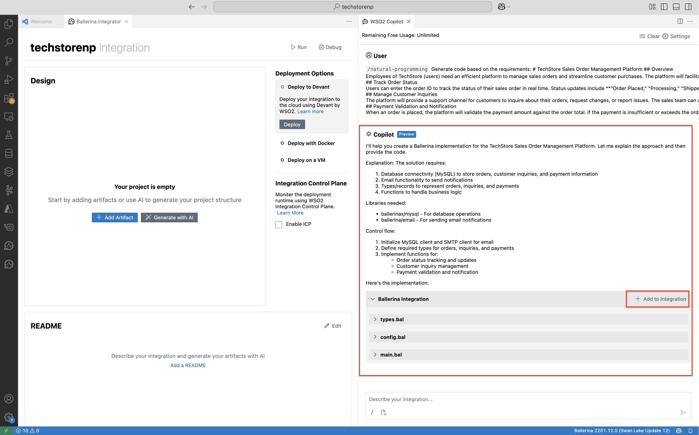
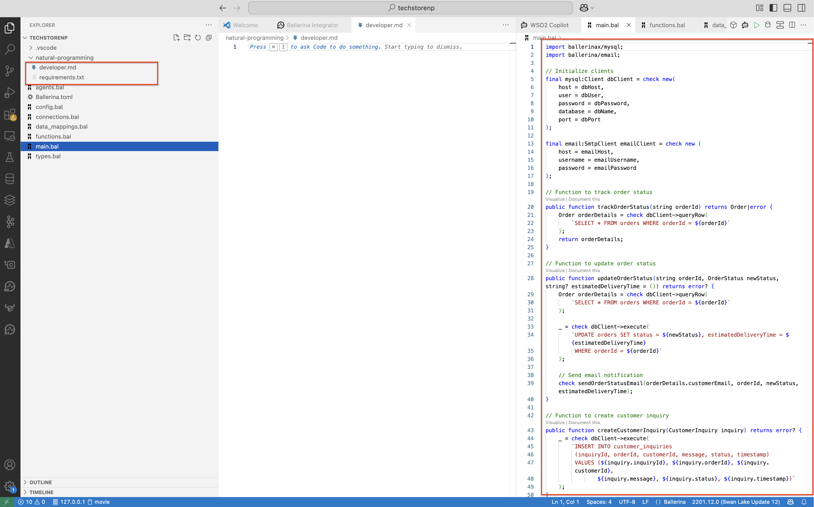
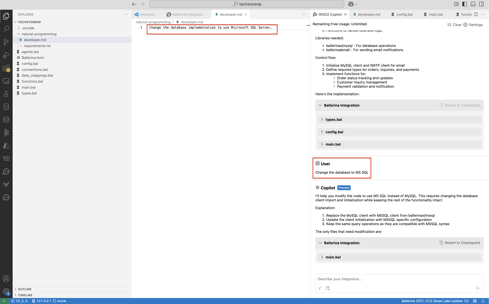
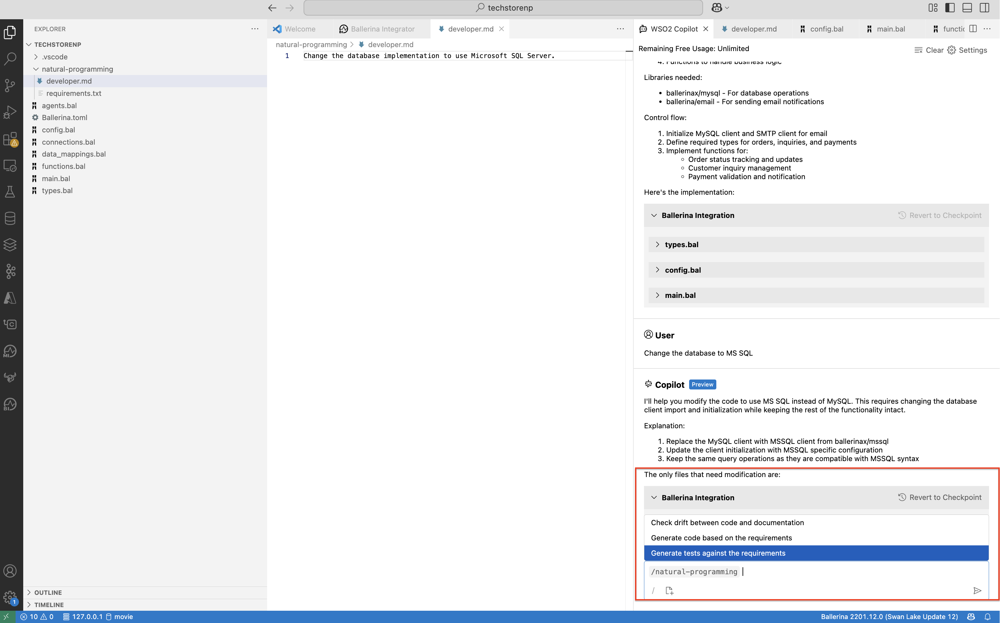
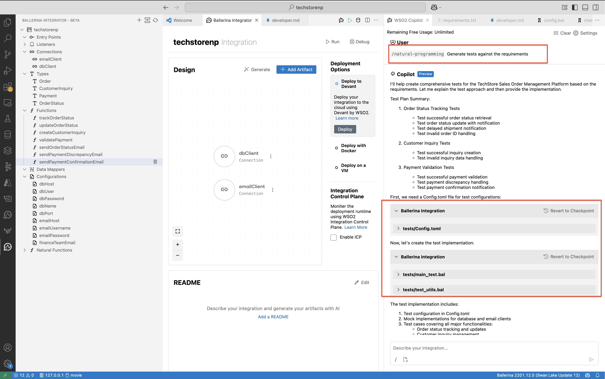

# Natural Programming with Ballerina Integrator

## Prerequisties

Visul Studio Code with [Ballerina Integrator](https://marketplace.visualstudio.com/items?itemName=WSO2.ballerina-integrator) plugin installed. Refer to the [Getting Started](https://wso2.github.io/docs-bi/get-started/quick-start-guide/) for more details. 

## Development time prompt to code - Developer in the loop

1. Let's start by creating a new integration in Ballerina Integrator. 
    

    

- Integration name : `TechStore`
- Integration Path : Select a local path

2. Click on `Generate with AI` button and it will open the WSO2 Copilot window. 

    

3. It will open up the WSO2 Copilot window with various options as follows. And select `/natural-programming` to generate code based on the requirements.

    

4. Add the following requirements as the input. You can provide any technical requirement as per your needs. 

    ```
    # TechStore Sales Order Management Platform

    ## Overview

    Employees of TechStore (users) need an efficient platform to manage sales orders and streamline customer purchases. The platform will facilitate the tracking of sales orders and handling customer inquiries.

    ## Track Order Status

    Users can enter the order ID to track the status of their sales order in real time. Status updates include **"Order Placed," "Processing," "Shipped," and "Delivered."** For delayed shipments, the platform will send proactive notifications to the customer with estimated delivery times. Additionally, the platform will validate the order ID and send an email confirmation to the customer once the status is updated.

    ## Manage Customer Inquiries

    The platform will provide a support channel for customers to inquire about their orders, request changes, or report issues. The sales team can access customer communication history and respond promptly to resolve concerns.

    ## Payment Validation and Notification

    When an order is placed, the platform will validate the payment amount against the order total. If the payment is insufficient or exceeds the order amount, an email notification will be sent to both the customer and the finance team (default **"finance@techstore.com"**, configurable) to resolve the discrepancy. Once the payment is verified, the order status will be updated, and a confirmation email will be sent to the customer.
    ```

5. You can see the generated code and add it to the integration

    

6. Now, you can see the code is generated and `requirement.txt` (which contains the original user requirements) and `developer.md` (which contains developer level changes) is added to the integration.


    

7. Now, if the developer wants to change some details about the generated code, he can request it. Once the change is added to the integration `developer.md` is updated to preserve the developer prompts.

    

8. Then you can generate the tests for the code based on the given requirements.

    

    

## Compile time prompt to code - Compiler in the loop


## Runtime prompt as code  - Natural Functions

