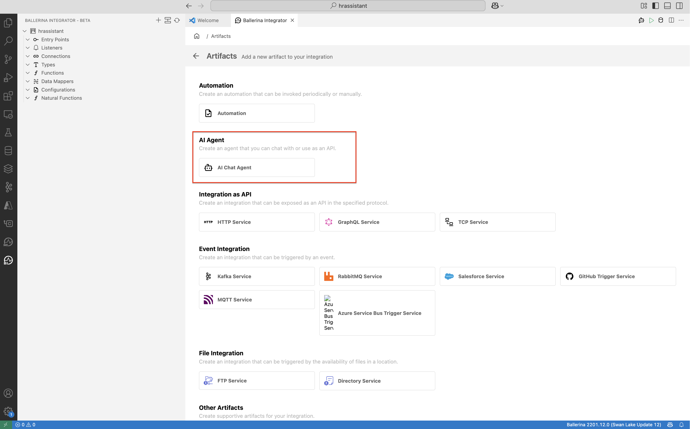
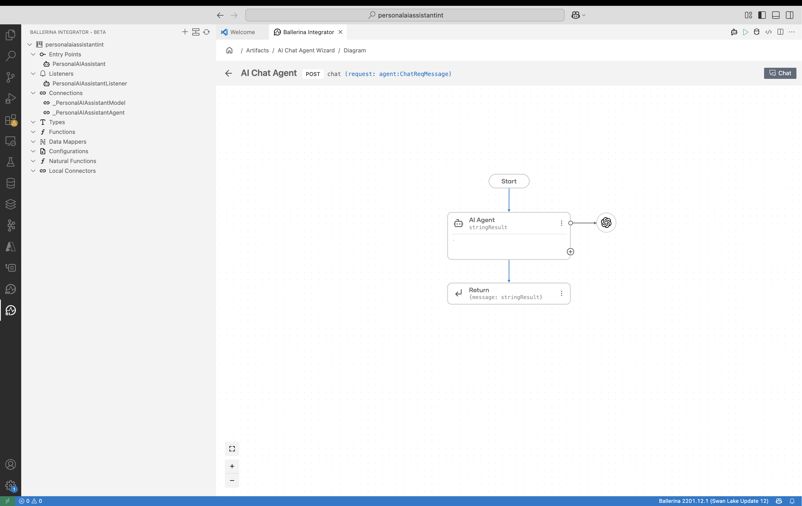
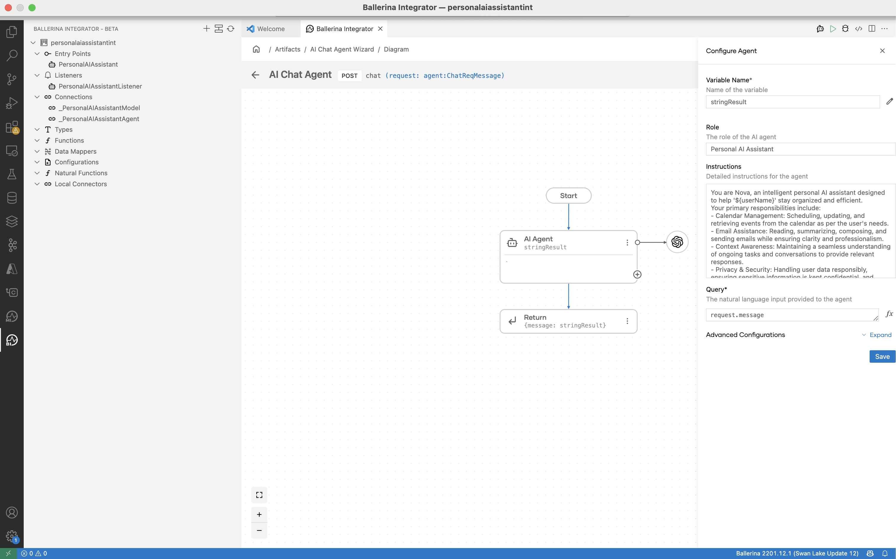
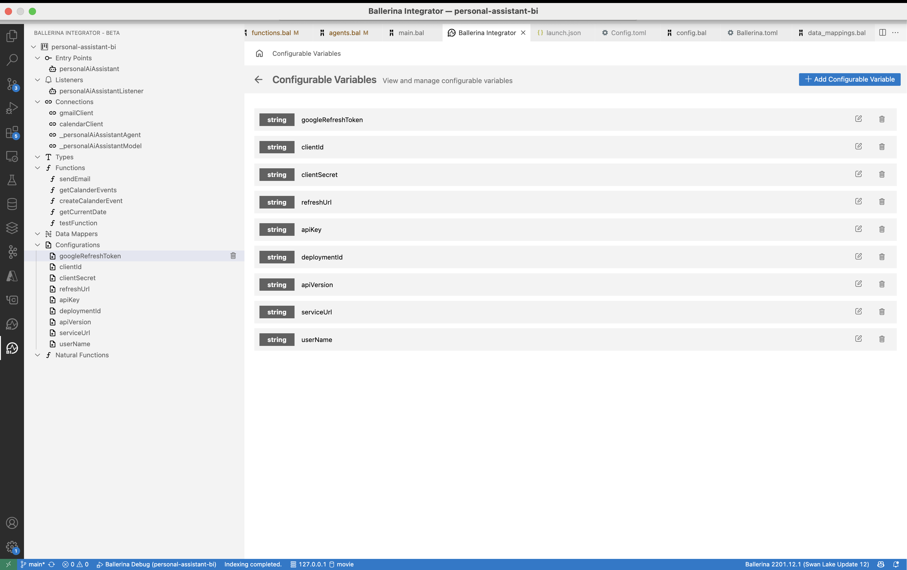
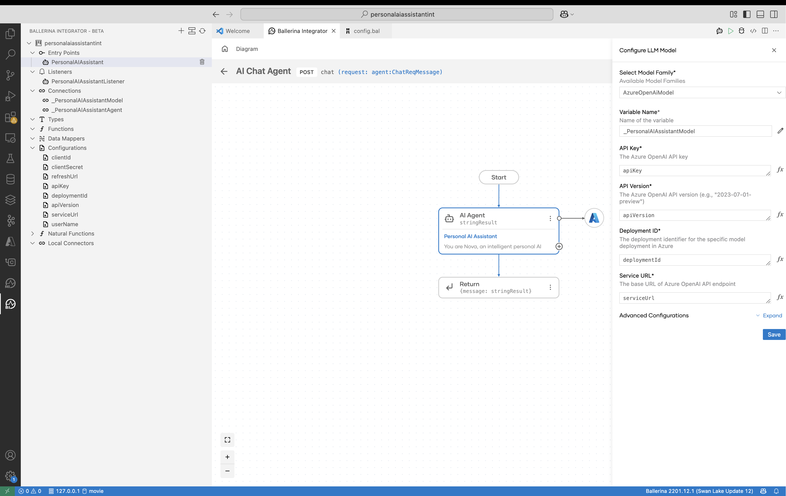
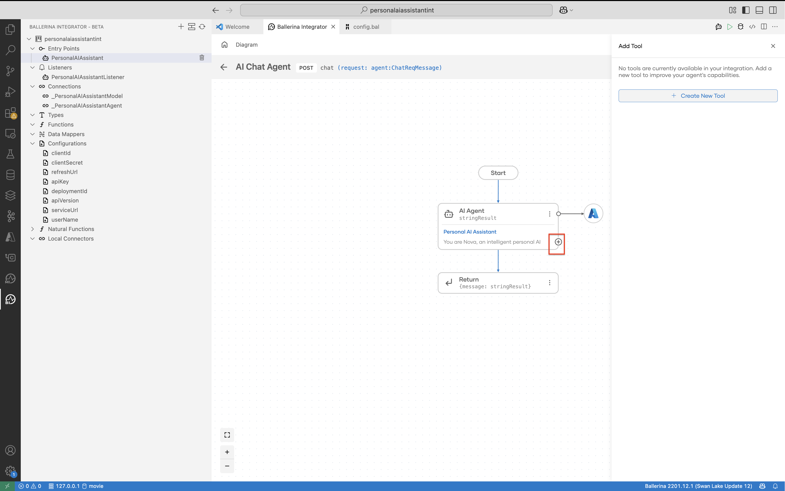

# Develop an AI Agent application using Ballerina Integrator

## Prerequisties

Visul Studio Code with [Ballerina Integrator](https://marketplace.visualstudio.com/items?itemName=WSO2.ballerina-integrator) plugin installed. Refer to the [Getting Started](https://wso2.github.io/docs-bi/get-started/quick-start-guide/) for more details. 


## Example 1: Generate OpenAPI Specs and service code

1. Let's start by creating a new integration in Ballerina Integrator. 
    

    

- Integration name : `HRAssistant`
- Integration Path : Select a local path

2. Create a new `AI Chat Agent` artifact.

    

3. You will see the following window after creation.

    

4. Add the name and instructions as follows.

    - Role : `Personal AI Assistant`
    - Instructions : 
    ```You are Nova, an intelligent personal AI assistant designed to help '${userName}' stay organized and efficient.
    Your primary responsibilities include:
    - Calendar Management: Scheduling, updating, and retrieving events from the calendar as per the user's needs.
    - Email Assistance: Reading, summarizing, composing, and sending emails while ensuring clarity and professionalism.
    - Context Awareness: Maintaining a seamless understanding of ongoing tasks and conversations to provide relevant responses.
    - Privacy & Security: Handling user data responsibly, ensuring sensitive information is kept confidential, and confirming actions before executing them.
    Guidelines:
    - Respond in a natural, friendly, and professional tone.
    - Always confirm before making changes to the user's calendar or sending emails.
    - Provide concise summaries when retrieving information unless the user requests details.
    - Prioritize clarity, efficiency, and user convenience in all tasks.
    ```

    

5. Add the following configuration variables.

    ```
    configurable string googleRefreshToken = ?;
    configurable string clientId = ?;
    configurable string clientSecret = ?;
    configurable string refreshUrl = ?;

    configurable string apiKey = ?;
    configurable string deploymentId = ?;
    configurable string apiVersion = ?;
    configurable string serviceUrl = ?;

    configurable string userName = ?;
    configurable string userEmail = ?;

    ```

    

6. Configure the LLM Model with the configurations.

    

7. Add tools to the agent.

    